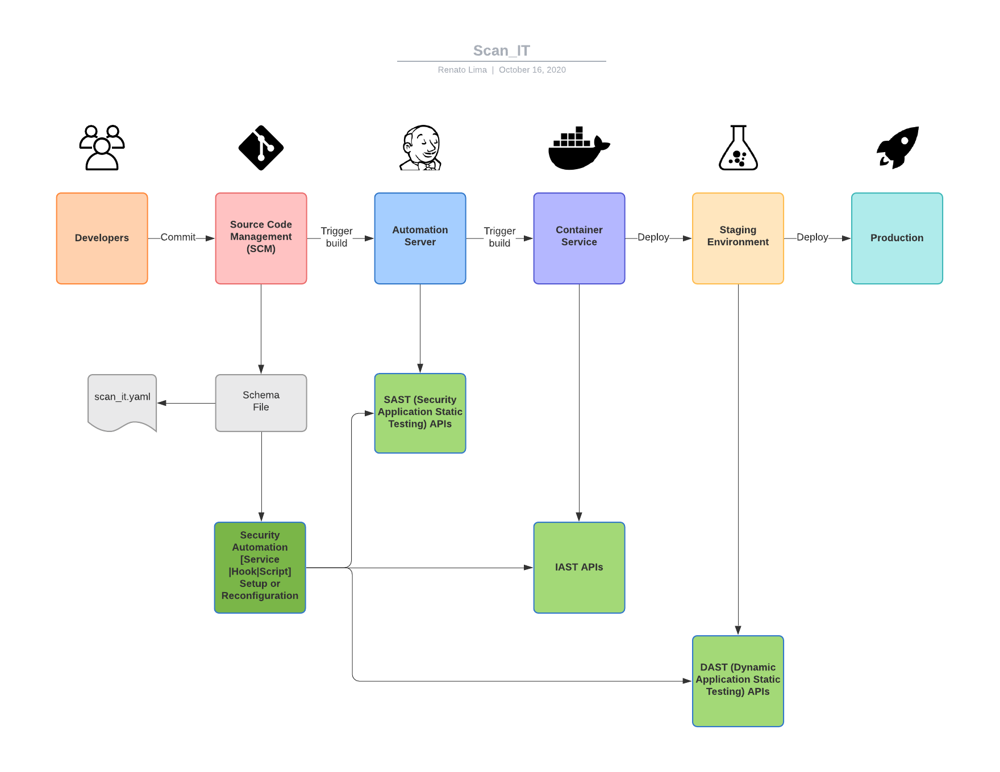

#  Proposed Solution

Enter the scan_it.yaml file: A structured approach to describe the relevent properties of a code repository to SAST/DAST/IAST Tools.

     As a development team, you will create and maintain a “scan_it” file in your code repo (think about it as CODEOWNERS on steroids).
     
     As a centralized security organization, you will now be able to parse scan_it files and automatically use your sast/dast provider APIs to automatically onboard/update the setup of applications to your tools.
     
     As a tool vendor, you will be able to support your customers in the challenging mission of onboarding applications into your products. Better time to market for your customers, higher customer satisfaction.
     
     

## In a nutshell

- It allows developers to enjoy the flexibility of no central repository creation workflows
- It allows security teams to track code repository ownership, phase, contact info, folder exclusions, etc. For simplified SAST tools automations and management
- It minimizes de time for project onboarding and notification of code scanner findings
- Given limited AppSec engineer time and budget, it helps reducing risk by making the overall process more efficient 

 

  
